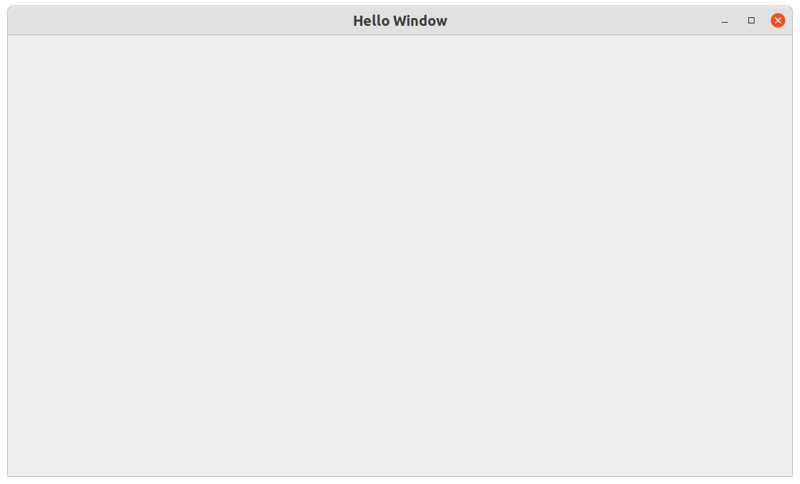

### New to PySide6?
If you are new to PySide6 (Qt6 for Python), here are the basics.

Qt6 is a multi-platform Graphical User Interface (GUI) development library. 
It provides GUI components like windows, buttons, textedits, text areas, canvas to draw to etc.
The basic GUI component in Qt6 is a "widget." For example, a button is a widget.

To create a GUI Application we create a main window, create the necessary widgets, lay them out and wire them up with the expected user interaction logic.

### Creating an application window
PySide6 provides a QMainWindow class to create Application Main Windows. Here's a nice [tutorial](https://doc.qt.io/qtforpython-6/tutorials/datavisualize/add_mainwindow.html?highlight=qmainwindow) on how to create a PySide6 Application Window

We will subclass QMainWindow; and add it to the QApplication we created.

$ python app.py  

