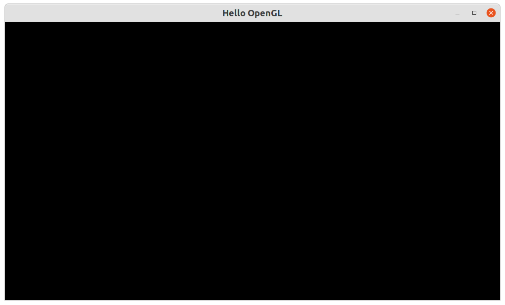

### PySide6 support for OpenGL 
Now that we have a window, we should add a widget (remember, a widget is a GUI component) on which we can render OpenGL.

PySide6 offers three ways to render OpenGL.

1. QOpenGLWidget
2. QWindow; and
3. QOpenGLWindow

QWindow and its convenient class QOpenGLWindow have better performace; but should be used in special scenarios.
QOpenGLWidget is the [recommended](https://doc.qt.io/qtforpython-6/PySide6/QtOpenGLWidgets/QOpenGLWidget.html?highlight=perspective#alternatives) stable and cross-platform solution. 

### QOpenGLWidget 
We will [subclass QOpenGLWidget](RenderWidget.py) and add it to the [MainWindow](MainWindow.py).
We should re-implement [three methods](https://doc.qt.io/qtforpython-6/PySide6/QtOpenGLWidgets/QOpenGLWidget.html?highlight=perspective#detailed-description) of QOpenGLWidget class.
 - initializeGL() : set up OpenGL State
 - resizeGL() : called when the widget is resized; and,
 - paintGL() : renders the OpenGL scene 

Please note that [QOpenGLWidget](https://doc.qt.io/qtforpython-6/PySide6/QtOpenGLWidgets/QOpenGLWidget.html) is not a busy-waiting loop. It is rather an "event-driven" one. New renders through paintGL() happens only when a change in the scene or OpenGL state happens. If there is no change in the scene or OpenGL state, paintGL() is not called. If we want to re-render, we should call the *update()* method.

[QSurfaceFormat()](https://doc.qt.io/qtforpython-6/PySide6/QtGui/QSurfaceFormat.html?highlight=qsurfaceformat) helps us manage OpenGL version/profile and request depth/stencil buffers. 
[devicePixelRatio()](https://doc.qt.io/qtforpython-6/PySide6/QtGui/QPaintDevice.html?highlight=devicepixel%20ratio#PySide6.QtGui.PySide6.QtGui.QPaintDevice.devicePixelRatio) maps input coordinates to pixel coordinates. 

### Additional PySide6 Documentation of interest
Further, the following modules provide for OpenGL support on PySide6:  
1. [PySide6.QtOpenGL](https://doc.qt.io/qtforpython-6/PySide6/QtOpenGL/index.html#module-PySide6.QtOpenGL) 
2. [PySide6.QtOpenGLWidgets](https://doc.qt.io/qtforpython-6/PySide6/QtOpenGLWidgets/index.html#module-PySide6.QtOpenGLWidgets) 
3. PySide6.QtOpenGLFunctions]  

We will need to use the following modules often, for GUI related tasks: 
4. [PySide6.QtWidgets](https://doc.qt.io/qtforpython-6/PySide6/QtWidgets/index.html#module-PySide6.QtWidgets)  
5. [PySide6.QtGui](https://doc.qt.io/qtforpython-6/PySide6/QtGui/index.html#module-PySide6.QtGui)  
6. [PySide6.QtCore](https://doc.qt.io/qtforpython-6/PySide6/QtCore/index.html#module-PySide6.QtCore)  
