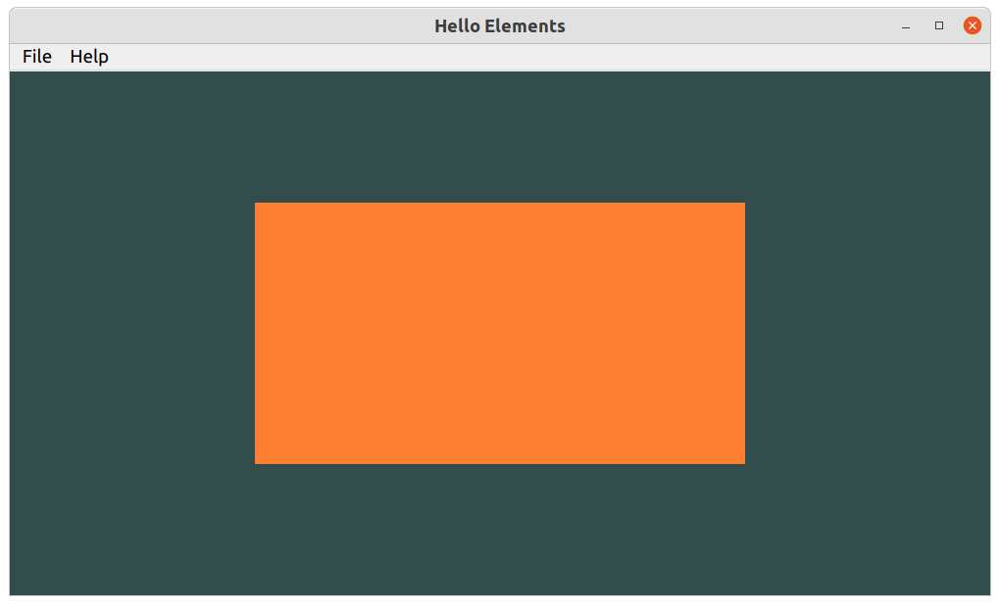

##### Vertices and indices
We define the vertex and index arrays as below:

        vertices = np.array([  0.5,  0.5, 0.0,  # top right
                               0.5, -0.5, 0.0,  # bottom right
                              -0.5, -0.5, 0.0,  # bottom left
                              -0.5,  0.5, 0.0   # top left 
                             ], dtype=np.float32 )
        indices = np.array([  # note that we start from 0!
                              0, 1, 3,   # first triangle
                              1, 2, 3    # second triangle
                            ], dtype=np.uint32 )
Please note the data types. Both float32 and unit32 take 4 bytes of storage per element.

##### Element Buffer Objects
Element Buffer objects provided for by [QOpenGLBuffer](https://doc.qt.io/qtforpython-6/PySide6/QtOpenGL/QOpenGLBuffer.html?highlight=qopenglbuffer#detailed-description) class.
Please note that the VAO should be created and bound before EBO is bound.

        # create and bind the EBO (with an active VAO)
        self.ebo = QOpenGLBuffer(QOpenGLBuffer.IndexBuffer)
        self.ebo.create()
        self.ebo.bind()
        self.indices_data = indices.tobytes()
        self.ebo.allocate( VoidPtr(self.indices_data), 4 * indices.size )
        
##### Drawing Elements.
This is straight forward.

        self.program.bind()
        vao_binder = QOpenGLVertexArrayObject.Binder(self.vao)
        #GL.glPolygonMode(GL.GL_FRONT_AND_BACK, GL.GL_LINE)
        f.glDrawElements(GL.GL_TRIANGLES, 6, GL.GL_UNSIGNED_INT, VoidPtr(0))
        self.program.release()

For wireframe, please uncomment the glPolygonMode call.

