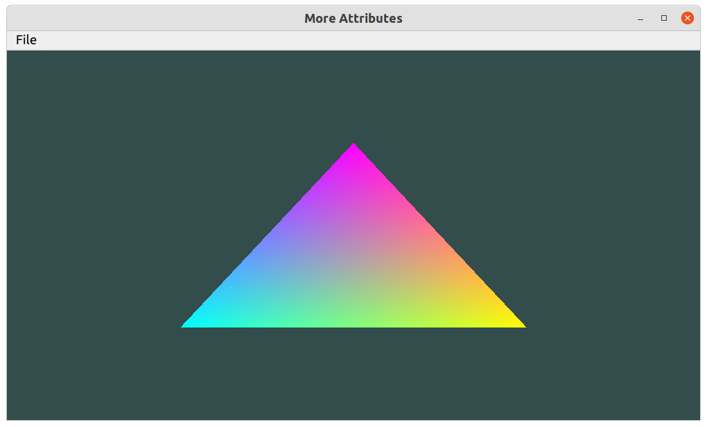

##### More Attributes
We combine vertice and color informations as below:
 
     
     vertices = np.array([
          #// positions    #// colors
          0.5, -0.5, 0.0,  1.0, 1.0, 0.0,  # // bottom right
         -0.5, -0.5, 0.0,  0.0, 1.0, 1.0,  # // bottom left
          0.0,  0.5, 0.0,  1.0, 0.0, 1.0   # // top 
     ], dtype=np.float32)
     
And we use [QOpenGLShaderProgram.setAttributeBuffer(location, type, offset, tupleSize[, stride=0])](https://doc.qt.io/qtforpython-6/PySide6/QtOpenGL/QOpenGLShaderProgram.html?highlight=shaderprogram#PySide6.QtOpenGL.PySide6.QtOpenGL.QOpenGLShaderProgram.setAttributeBuffer) to manage the attributes in the vertex shader.

     self.program.setAttributeBuffer(0, GL.GL_FLOAT, 0, 3, 6 * vertices.itemsize )
     self.program.setAttributeBuffer(1, GL.GL_FLOAT, 3 * vertices.itemsize, 3, 6 * vertices.itemsize )
     self.program.enableAttributeArray(0)
     self.program.enableAttributeArray(1)
        
 
